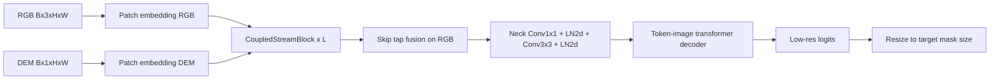

# Terrascope Architecture: Deep Technical Description

This document explains the Terrascope network strictly from the implemented codebase.  
The goal is to make each component understandable at implementation depth: what it receives, what transforms it applies, why those transforms are useful, and how modules interact during forward and training.

---

## 1) Problem framing and design intent

Terrascope performs binary landslide segmentation from two physically different but complementary streams:

- **RGB stream**: texture, color, albedo, context.
- **DEM stream**: elevation morphology, slope transitions, terrain continuity.

The model is designed so both streams remain explicit through the encoder depth, rather than collapsing DEM into a one-time channel concatenation. This enables:

- early and repeated cross-modal interaction,
- stream-specific processing depth,
- terrain-conditioned regularization via dedicated losses.

---

## 2) Tensor notation and shapes


| Symbol           | Meaning                                        |
| ---------------- | ---------------------------------------------- |
| B                | batch size                                     |
| H, W             | input image height and width                   |
| P                | patch size (16 in current build)               |
| h = H/P, w = W/P | token-grid resolution                          |
| N = h \cdot w    | number of spatial tokens                       |
| D                | encoder embedding width (768 in current build) |
| C                | decoder embedding width (256 in current build) |


Core stream states at depth \ell:

X^{\ell}*{rgb}, X^{\ell}*{dem} \in \mathbb{R}^{B \times h \times w \times D}

Final encoder output to the decoder:

E \in \mathbb{R}^{B \times C \times h \times w}

---

## 3) End-to-end execution graph




### High-level sequence

1. Convert RGB and DEM images to aligned token grids.
2. Process both token streams through `L` coupled blocks.
3. Inject selected intermediate RGB states back into the final RGB state via gated lateral skips.
4. Project to decoder width through a two-stage neck.
5. Decode masks with token-image transformer interactions.
6. Upsample logits to supervision resolution.

---

## 4) Core modules in detail

### 4.1 `core/positional.py` — PEG

`PEG` adds local spatial bias directly on token maps:

1. reshape tokens (B,N,D)\to(B,D,h,w),
2. depthwise k\times k convolution (`groups=D`),
3. scaled residual add with learnable \gamma,
4. flatten back to token sequence.

Why this matters: attention alone is permutation-sensitive unless positional structure is injected. PEG supplies local geometry without expensive absolute embedding tables.

---

### 4.2 `core/image_encoder.py` primitives

This file provides generic transformer image primitives used by the encoder:

- `PatchEmbed`: `Conv2d` projection then channel-last layout.
- `Attention`: multi-head attention with optional decomposed relative position terms.
- `Block`: pre-norm attention + MLP residual block.
- `window_partition` / `window_unpartition`: local-window attention support.

Important behavior:

- windowed attention reduces quadratic cost on high-resolution token grids,
- selected layers can run global attention by setting `window_size=0`,
- relative position terms preserve geometric consistency when tokens move across windows.

---

### 4.3 `core/blocks.py` — coupled stream internals

#### a) `JointStreamAttention`

This module performs stream-native joint attention:

1. normalize RGB and DEM token sequences independently,
2. build stream-specific queries (`q_rgb`, `q_dem`),
3. build K/V from both streams,
4. split heads into two halves:
  - first half attends with one modality’s keys/values,
  - second half attends with the other modality’s keys/values.

Effect: each stream receives both self-consistent and cross-modal evidence within one attention pass.

#### b) `CrossStreamFusionBlock`

Second fusion stage after joint attention:

1. bidirectional cross-attention (RGB→DEM context and DEM→RGB context),
2. gate synthesis:
  - **channel gate** from pooled descriptors,
  - **spatial gate** from mean-projected feature maps,
  - **confidence gate** from DEM dispersion statistics,
3. gated residual updates on both streams,
4. linear mix on concatenated stream states.

This gives adaptive, content-aware exchange instead of fixed weighted sums.

#### c) `GeoStateBlock`

Terrain propagation block:

1. layer normalization,
2. linear expansion to content and gate branches,
3. depthwise spatial convolution on content branch,
4. sigmoid gating,
5. projected residual output.

Interpretation: a lightweight local state transition that smooths and propagates morphologic evidence across neighboring tokens.

#### d) `CoupledStreamBlock`

Per depth \ell, the exact order is:

1. PEG on RGB and DEM,
2. `JointStreamAttention`,
3. stream-specific transformer `Block` on RGB,
4. stream-specific transformer `Block` on DEM,
5. `CrossStreamFusionBlock`,
6. concatenate streams and project to fused RGB state,
7. `GeoStateBlock` on fused RGB state,
8. update DEM with a second projection that reuses updated RGB.

This staged structure intentionally alternates:

- **joint token mixing**,
- **stream-private reasoning**,
- **gated stream exchange**,
- **terrain-local propagation**.

---

### 4.4 `core/encoder.py` — `TerrascopeEncoder`

#### Input tokenization

- RGB: `PatchEmbed` with `in_chans=3`.
- DEM: `DEMPatchEmbed` with identical kernel/stride but `in_chans=1`.

Identical patch geometry ensures both streams stay pixel-aligned in token space.

#### Depth stack

- `depth=12` coupled blocks by default.
- Window/global schedule controlled by `global_attn_indexes`.

#### Lateral skip injection

For selected layer indices (default `3,7,11`):

1. project RGB state via `1x1 Conv + GELU`,
2. keep in channel-last token-grid layout,
3. add to final RGB state weighted by `sigmoid(skip_balance[k])`.

This acts as controlled multi-depth feature reinjection.

#### Neck projection

The neck maps D\to C and refines channels spatially:

1. `Conv1x1(D→C)`,
2. `LayerNorm2d(C)`,
3. `Conv3x3(C→C)`,
4. `LayerNorm2d(C)`.

#### Mid-level capture for auxiliary supervision

At `mid_aux_layer` (default 5), both stream tensors are cached for auxiliary heads used by uncertainty-aware loss terms.

---

### 4.5 `core/position_encoding.py` — stochastic spatial encoding

`PositionEmbeddingRandom` maps normalized coordinates through a fixed random Gaussian projection and sinusoidal basis:

\phi(x,y) = [\sin(2\pi G[x,y]), \cos(2\pi G[x,y])]

where G is sampled once and stored as a buffer.

Used to generate dense positional channels matching decoder spatial resolution.

---

### 4.6 `core/transformer.py` — token-image interaction stack

This module performs iterative coupling between sparse token queries and dense image keys:

Each `TwoWayAttentionBlock` contains:

1. token self-attention,
2. token-to-image cross-attention,
3. token MLP update,
4. image-to-token cross-attention.

The final block adds one more token-to-image attention and normalization.  
Output: updated token states and updated dense states.

---

### 4.7 `core/mask_decoder.py` — mask synthesis

Mask decoding pipeline:

1. create output tokens (`iou_token` + `mask_tokens`),
2. concatenate with sparse prompt tokens (empty in current training),
3. add dense prompt embedding to image embeddings,
4. run transformer interaction (`TwoWayTransformer`),
5. upsample dense embedding via two transposed convolutions,
6. generate per-mask hypernetwork vectors from mask tokens,
7. project upscaled embedding with those vectors to get mask logits,
8. predict quality score with an MLP head.

Current training path selects the first mask (`multimask_output=False`).

---

### 4.8 `core/model.py` — integration layer

`Terrascope` wires all major components:

- `TerrascopeEncoder`,
- prompt bundle (`PositionEmbeddingRandom` + no-mask embedding),
- decoder stack,
- two auxiliary heads (`1x1 conv`) for RGB/DEM intermediate logits.

Forward contract:

```text
inputs: rgb, dem, image_pe, dense_prompt
outputs: masks, iou_scores, optional_aux_pair
```

Auxiliary outputs are produced only if `return_aux=True`.

---

## 5) Loss system and optimization behavior

### 5.1 Standard losses (`losses/standard.py`)

- `bce_with_logits_loss`: per-pixel probabilistic classification.
- `dice_loss`: overlap-focused region consistency.
- `tversky_loss`: class-imbalance control with asymmetric FP/FN weighting.
- `focal_loss`: hard-example emphasis.
- `soft_iou_loss`: differentiable IoU objective.
- `gradient_l1_boundary_loss`: aligns gradient fields of prediction and target.

### 5.2 TGBC (`losses/terrain_multistream_losses.py`)

Topographic Gradient-Boundary Calibration:

1. compute DEM gradient unit vector field,
2. compute predicted probability gradient field,
3. detect high-boundary band using gradient magnitude quantile,
4. enforce alignment in the band,
5. apply softer orthogonality regularization outside band.

TGBC explicitly ties boundary orientation to terrain structure.

### 5.3 CSCD (`losses/terrain_multistream_losses.py`)

Cross-Stream Calibrated Disagreement:

1. use auxiliary RGB/DEM logits as two views,
2. compute uncertainty from entropy of their mean probability,
3. high-uncertainty region: symmetric KL coupling between views,
4. low-uncertainty region: agreement with main head output.

This avoids forcing global agreement everywhere and instead targets unstable regions.

### 5.4 Composite objective (`losses/composite.py`)

Total loss:

\mathcal{L}*{total} = \sum*{k} w_k \mathcal{L}_k

Only active terms (weight >0) are computed.  
If no term is active, training raises an explicit error.

---

## 6) Training loop behavior (`training/train.py`)

Per iteration:

1. load `(rgb, dem, mask, meta)` batch,
2. compute embedding-grid shape from input size and patch size,
3. generate dense positional map and dense no-mask prompt,
4. forward model (optionally with auxiliary logits if CSCD enabled),
5. keep one mask channel, resize logits to target size,
6. compute weighted composite loss,
7. backprop and optimizer step.

Per epoch:

- evaluate on test (and optional val),
- append metrics rows to CSV,
- checkpoint every `save_every` epochs.

Checkpoints include full model and optimizer state.

---

## 7) Full algorithm (implementation-granular)

### Algorithm 1 — Forward pass

```text
Input:
  rgb ∈ R^{B×3×H×W}, dem ∈ R^{B×1×H×W}
  image_pe ∈ R^{B×C×h×w}, dense_prompt ∈ R^{B×C×h×w}

Encoder:
  x_rgb ← PatchEmbed(rgb)            // B×h×w×D
  x_dem ← DEMPatchEmbed(dem)         // B×h×w×D
  for layer index ℓ in [0, L-1]:
      x_rgb, x_dem ← CoupledStreamBlock_ℓ(x_rgb, x_dem)
      if ℓ == mid_aux_layer:
          mid_rgb ← x_rgb, mid_dem ← x_dem
      if ℓ in skip_tap_layers:
          sℓ ← lateral_1x1_gelu(x_rgb)
          cache sℓ
  x_rgb ← x_rgb + Σ sigmoid(skip_balance[k])·s_k
  enc ← neck(x_rgb)                  // B×C×h×w

Decoder:
  sparse ← zeros(B,0,C)
  masks, iou ← MaskDecoder(
      image_embeddings=enc,
      image_pe=image_pe,
      sparse_prompt_embeddings=sparse,
      dense_prompt_embeddings=dense_prompt,
      multimask_output=False
  )

Auxiliary:
  if return_aux:
      aux_rgb ← conv1x1(mid_rgb)
      aux_dem ← conv1x1(mid_dem)
      aux ← (aux_rgb, aux_dem)
  else:
      aux ← None

Return:
  masks, iou, aux
```

### Algorithm 2 — Training step

```text
for each batch (rgb, dem, mask):
    eh ← H/patch_size, ew ← W/patch_size
    pe ← dense_pe((eh, ew))
    dense ← no_mask_embed broadcast to B×C×eh×ew

    logits, _, aux ← model(rgb, dem, pe, dense, return_aux=(w_cscd > 0))
    logits ← logits[:,0:1]
    logits ← bilinear_resize(logits, mask.shape[-2:])

    loss, log_parts ← composite_segmentation_loss(
        logits=logits,
        target=mask,
        dem=dem,
        aux=aux,
        weights=LossWeights(...)
    )
    optimizer.zero_grad()
    loss.backward()
    optimizer.step()
```

---

## 8) File-level architecture map


| Path                                   | What it contains                                                                        |
| -------------------------------------- | --------------------------------------------------------------------------------------- |
| `terrascope/core/common.py`            | `MLPBlock`, `LayerNorm2d`                                                               |
| `terrascope/core/positional.py`        | PEG token positional augmentation                                                       |
| `terrascope/core/image_encoder.py`     | patch embedding and transformer block primitives                                        |
| `terrascope/core/blocks.py`            | `JointStreamAttention`, `CrossStreamFusionBlock`, `GeoStateBlock`, `CoupledStreamBlock` |
| `terrascope/core/encoder.py`           | `TerrascopeEncoder`, dual stems, depth stack, skip taps, neck                           |
| `terrascope/core/position_encoding.py` | random Fourier-style coordinate encoding                                                |
| `terrascope/core/transformer.py`       | two-way token-image attention blocks                                                    |
| `terrascope/core/mask_decoder.py`      | mask token decoding and hypernetwork projection                                         |
| `terrascope/core/model.py`             | complete integrated model and builder                                                   |
| `terrascope/losses/`                   | standard losses + terrain/multistream losses + weighted composition                     |
| `terrascope/training/train.py`         | full training/eval/checkpoint pipeline                                                  |


---

## 9) Practical notes

- Architecture is trained from scratch; there is no pretrained checkpoint loader path.
- Decoder output is lower resolution than input by design; training upsamples logits before supervision.
- Auxiliary heads exist for loss-level calibration and are not mandatory for inference.
- `LandslideArchitectureDiagram.tsx` should be interpreted alongside this document for a visual pathway view.

---

## 10) Why this architecture: rationale, novelty, and relation to SAM

This section answers why Terrascope settled on its current design, what problems it targets, how it differs from SAM, and what ideas are intentionally **theory-motivated** versus **engineering reuse**. It complements Sections 1–9, which describe *what* the code does; here we articulate *why*.

### 10.1 What landslide segmentation actually needs

Landslides are not generic “objects in a photo.” Useful cues split across:

- **Appearance (RGB):** vegetation change, bare soil, shadows, texture, context from surrounding land cover.
- **Morphology (DEM):** scar geometry, elevation breaks, concavities, drainage alignment, and spatial continuity of terrain.

A model that only sees RGB misses stable morphologic evidence; a model that only sees DEM misses spectral change and context. **Naive early fusion** (e.g. concatenate DEM as extra channels once, then a single ViT) tends to **collapse** the two physics into one latent path too early, so the optimizer cannot maintain **stream-specific reasoning** or **calibrated disagreement** between “what looks like a slide” and “where terrain says a slide is plausible.”

Terrascope’s central design bet is therefore: **keep RGB and DEM as explicit parallel encodings through depth**, and only compress to a single dense representation **after** repeated, gated cross-modal exchange—then decode segmentation with a head strong enough for sharp masks.

### 10.2 Why we settled on this stack (encoder + mask-style decoder)

**Dual-stream coupled encoder (from scratch):**

- **JointStreamAttention** mixes modalities *inside* attention (split-head K/V from RGB vs DEM) so each location can attend to both self-similarity and cross-stream evidence in one pass.
- **Per-stream ViT blocks** preserve modality-specific refinement (window/global schedule as in strong vision transformers).
- **CrossStreamFusionBlock** adds explicit cross-attention and **content-aware gates** (channel, spatial, DEM-dispersion “confidence”), rather than a fixed blend.
- **GeoStateBlock** injects a **local terrain propagation** bias (depthwise conv on tokens)—a lightweight inductive bias that attention alone does not enforce.
- **PEG** supplies **local geometry** on token grids without huge absolute PE tables.
- **Lateral skip taps** reinject mid-depth RGB structure into late layers with learned strengths—stabilizing boundary and multi-scale detail.

**Mask decoder topology (random init, not SAM pretraining):**

The **token–image two-way transformer + hypernetwork mask synthesis** pattern is retained because it is a **strong dense prediction head**: it iteratively grounds sparse mask hypotheses in the dense embedding map and produces multi-scale logits after upsampling. Here it is used as a **segmentation decoder** driven by a **minimal prompt** (dense no-mask embedding + positional encoding), not as an interactive prompt-and-click system. That is an **engineering choice**: reuse a proven decoding geometry while **replacing** the upstream representation with a **terrain-native encoder**.

**Losses as part of the “architecture story”:**

- **TGBC** encodes the hypothesis that **slide boundaries should align with topographic gradient structure** in high-gradient bands, with softer constraints elsewhere—geometry-aware boundary calibration, not generic edge loss alone.
- **CSCD** treats **auxiliary RGB vs DEM logits as two views** and applies **uncertainty-weighted** agreement or coupling—explicitly modeling **where the model should tolerate vs enforce** cross-stream consistency.

Together, backbone + head + losses form a **coherent landslide-centric system** rather than a single-module tweak.

### 10.3 How Terrascope differs from SAM (substantive, not branding)

| Aspect | SAM (as typically used) | Terrascope |
| ------ | ------------------------ | ---------- |
| **Inputs** | RGB (single stream). | **RGB + DEM**, dual stems, aligned patch geometry. |
| **Encoder** | Large ViT image encoder (often pretrained). | **Custom coupled encoder**; trained from scratch for this task. |
| **Fusion of modalities** | N/A (no DEM path). | **Depth-wise coupling**: joint attention, fusion, GeoState, skips. |
| **Role of prompts** | Central: points/boxes/masks drive segmentation. | **Minimal dense prompt** for training/inference wiring; not the product focus. |
| **Pretraining** | Foundation-model scale pretraining. | **No SAM checkpoint** in the training path; random init, domain data. |
| **Inductive biases for terrain** | None specific to topography. | **GeoState**, DEM-aware fusion gates, **TGBC**, **CSCD**. |
| **Objective** | General interactive segmentation. | **Binary landslide maps** with imbalance-aware and terrain-aware terms. |

So: Terrascope is **not** “SAM with extra channels.” It is **SAM-adjacent only at the decoder topology**, while the **scientific and implementation novelty** lies in the **multistream terrain encoder** and **theory-linked losses** for landslides.

### 10.4 What is genuinely novel vs what is deliberate reuse

**Novel or unusual for landslide segmentation (as an integrated system):**

1. **Persistent dual-stream tokens** with **joint MHSA** (split-head cross-stream K/V) plus **gated cross-attention fusion** and **terrain local propagation** in one repeated stage.
2. **Auxiliary mid-level dual heads** used not for ensembling alone but for **CSCD**—uncertainty-aware cross-stream calibration.
3. **TGBC**—explicit **alignment of prediction boundaries to DEM gradient structure** in a selected band—linking segmentation geometry to **DEM physics**, not only to label edges.
4. **End-to-end** training of this stack **without** inheriting a general-purpose frozen encoder—forcing the representation to adapt to **RGB–DEM joint statistics** of landslide-prone terrain.

**Deliberate reuse (not claimed as new ML primitives):**

- ViT-style **blocks**, windowing, relative bias utilities (see file headers / lineage in `image_encoder.py`).
- **Mask decoder + two-way transformer** layout for the final dense map—proven decoding mechanism, **reinitialized** for this pipeline.

Calling the project “groundbreaking” in a scientific sense should mean: **the combination and the problem-driven inductive biases** are the contribution—the mask head is **leverage**, not the thesis.

### 10.5 Why this is a strong architecture *for this task*

- **Segmentation as output:** The mask decoder outputs **pixel-aligned logits** (after upsampling), which matches standard landslide map evaluation and datasets.
- **DEM as a parallel hypothesis space:** Slides that are spectrally ambiguous may still be **morphologically consistent**; the encoder is built so DEM can influence RGB and vice versa **at multiple depths**, not once at the input.
- **Optimization pressure from theory-motivated losses:** The backbone is not only pulled by Dice/Tversky-style overlap; it is also shaped by **terrain-gradient boundary calibration** and **cross-stream uncertainty**—pressures that **RGB-only** or **early-fusion** models do not get by default.

### 10.6 “Out of the box” theoretical ideas the design introduces

These are the ideas the implementation is meant to embody—not as proofs in this doc, but as **explicit modeling commitments**:

1. **Topography-conditioned boundaries (TGBC):** In steep-gradient regions, predicted boundaries should be **statistically aligned** with DEM gradient orientation; elsewhere, orthogonality is relaxed—**geometry where it matters**.
2. **Epistemic use of multistream disagreement (CSCD):** High entropy of the mean of auxiliary views triggers **symmetric KL** coupling; low-entropy regions align with the **main head**—**calibrate where uncertain, consolidate where confident**.
3. **Terrain as local dynamical prior (GeoState):** A **depthwise spatial transition** on tokens approximates a **short-range propagation** of terrain evidence—complementary to global attention.
4. **Modality mixing at attention level (JointStreamAttention):** Cross-modal information enters **through attention’s K/V routing**, not only through additive feature fusion—**structured mixing** rather than a single concatenated channel block.

### 10.7 Why building Terrascope this way is “worth it” (research and deployment framing)

- **Reproducible story:** Encoder, decoder, and losses are **co-located in one codebase** with a clear forward contract—easier to ablate, publish, or extend (e.g. additional streams, new terrain losses).
- **No dependency on SAM weights:** Avoids domain mismatch and licensing/pretraining constraints while still benefiting from a **strong decoder shape**.
- **Explainable design axes:** One can disable TGBC/CSCD, remove GeoState, or simplify fusion and **measure** which inductive bias mattered—because the architecture is **modular by file and by block**.

In short: **Terrascope is positioned as a purpose-built, multistream, terrain-aware segmentation architecture** for landslides, using **a small set of strong borrowed primitives** where they do not contradict the scientific goal, and **investing novelty** where landslide physics and multistream statistics actually live—the **encoder coupling**, **terrain propagation**, and **theory-linked objectives**.

